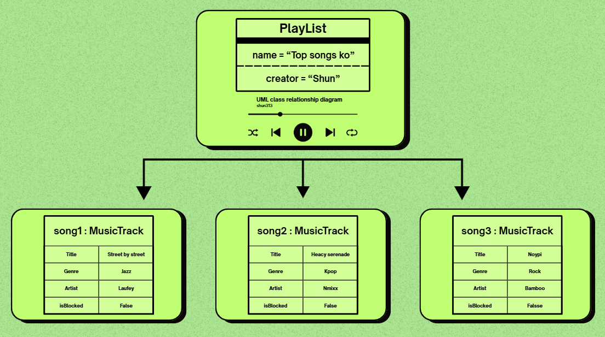

# Class Relationships: Association and Multiplicity 
## Previous Work 
[Part I - Classes and Objects](classObjectUML.md) 
[Part II - Class Attributes and Methods](classAttributesMethods.md) 
## Existing Class 
Class: MusicTrack
Description: A MusicTrack represents a song and contains information about it's title, genre, artist, and blocked status, it also represents a song in a music library or playlist.
## New Related Class 
Class: PlayList
Description: A playList represents a storage, it includes songs the user has added in that specific PlayList
## Association 
Relationship: PlayList contains MusicTrack
Explanation: A PlayList can contain multiple MusicTracks objects.
## Multiplicity
Multiplicity: 0..*
Explanation: A PlayList can have multiple MusicTrack objects or none.
## UML Class Relationship Diagram 
 

## Python Implementation 
[View Python Source](classRelationships.py) 
## Test Run 
 
## Object Relationship Diagram 
 
## Analysis 
### What is the association between your two classes? 

### What multiplicity did you choose and why? 

### How did you implement the relationship in Python? 

### Why did you store an object reference instead of copying its data? 

### If your relationship uses many, why is a list appropriate? 

